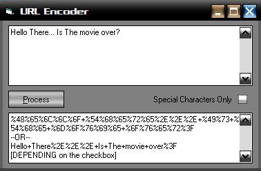



## URLEncoder

### Description

Encodes the given text into a format that can be understood by search engines and browsers, but not by humans without knowledge of URL Encoding, useful when making links to a weirdly-named file when handwriting HTML. An interesting side note: the program resizes controls on the fly to keep the layout constant.
 
### More Info
 
The text to be encoded goes on the top textbox.

The resulting encoded text is displayed on the bottom textbox

             |
---                |---
**Submitted On**   |2005-11-09 14:10:18
**By**             |[Ariel D\. Poliak](https://github.com/Planet-Source-Code/PSCIndex/blob/master/ByAuthor/ariel-d-poliak.md)
**Level**          |Beginner
**User Rating**    |5.0 (10 globes from 2 users)
**Compatibility**  |VB 6\.0
**Category**       |[Internet/ HTML](https://github.com/Planet-Source-Code/PSCIndex/blob/master/ByCategory/internet-html__1-34.md)
**World**          |[Visual Basic](https://github.com/Planet-Source-Code/PSCIndex/blob/master/ByWorld/visual-basic.md)
**Archive File**   |[URLEncoder1947251192005\.zip](https://github.com/Planet-Source-Code/ariel-d-poliak-urlencoder__1-63213/archive/master.zip)

